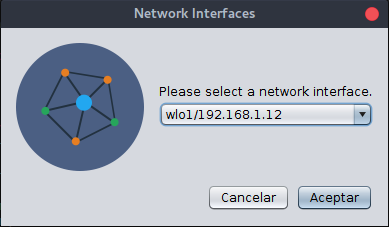
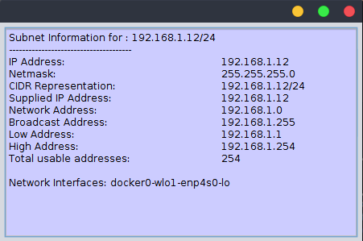
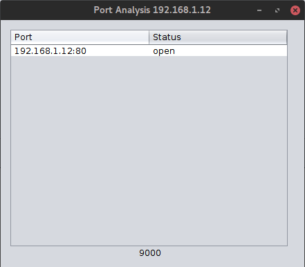
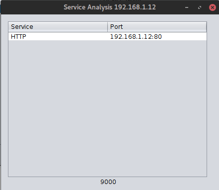
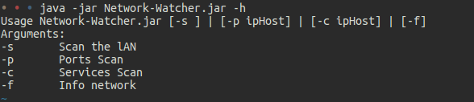
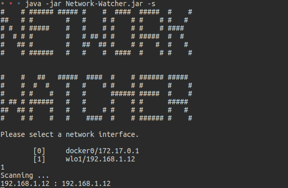
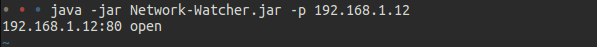
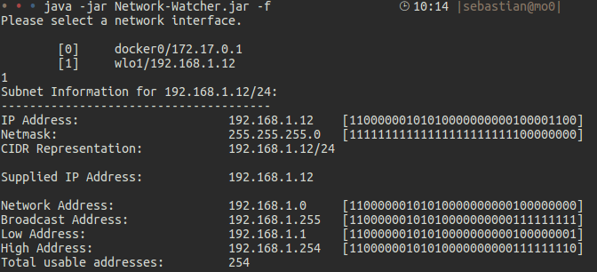

# Network Watcher

Multiplatform application that scans the local network identifying host and which ports it has open, also verifies services such as HTTP, SMTP and FTP.

## Select Network Interface
Now you can select the network Interface when starting the application and change when you need it from the file | switchNi menu.

## Graphic Interface
The graphical interface has options at the top.

## Subnet Information
You can see the subnet information in the file|About menu.

## Port Analysis
You can see all the ports open.

## Service Analysis
You can check the port for services such as HTTP, SMTP and FTP. It does not matter if they are in ports other than the default..

## Terminal Mode
Below you will find sample images of the operation by means of the terminal.

### Scan

### Services Scan

### Ports Scan

### Info Network

## Summary Ports
Below is a list of the most common ports with a brief description.

| Port | Name | Info |
| ------ | ------ | ------ |
| 20 | FTP Data | File Transfer Protocol (FTP) data transfer |
| 21 | FTP | File Transfer Protocol (FTP) control (command) |
| 22 | SSH | Secure Shell (SSH), secure logins, file transfers (scp, sftp) and port forwarding |
| 23 | Telnet | Telnet protocol—unencrypted text communications |
| 25 | SMTP | Simple Mail Transfer Protocol, used for email routing between mail servers |
| 53 | DNS | Domain Name System (DNS) |
| 59 | DCC | Direct Client-to-Client IRC software |
| 79 | Finger | Info about users |
| 80 | HTTP | Hypertext Transfer Protocol  |
| 110 | POP3 | Post Office Protocol, version 3 |
| 113 | IDENT | Ident, authentication service/identification protocol, used by IRC servers to identify users |
| 119 | NNTP | Network News Transfer Protocol, retrieval of newsgroup messages |
| 135 | NetBIOS | Service used to remotely manage services including DHCP server, DNS server and WINS |
| 139 | NETBIOS | NetBIOS Session Service |
| 143 | IMAP | Internet Message Access Protocol, management of electronic mail messages on a serve |
| 389 | LDAP | Lightweight Directory Access Protocol |
| 443 | HTTPS | Hypertext Transfer Protocol over TLS/SSL |
| 445 | MSFT DS | Microsoft-DS Active Directory, Windows shares |
| 563 | POP3 SSL | NNTP over TLS/SSL  |
| 993 | IMAP4 SSL | Internet Message Access Protocol over TLS/SSL |
| 995 | POP3 SSL | Post Office Protocol 3 over TLS/SSL |
| 1080 | Proxy | SOCKS proxy |
| 1723 | PPTP | Point-to-Point Tunneling Protocol |
| 3306 | MySQL | MySQL database system |
| 5000 | UPnP | Universal Plug'n'Play |
| 8080 | Proxy Web | Alternative port for HTTP |

## Javadoc
You can check the javadoc [here](doc/index.html).

## License
[GPL v3](LICENSE).
> **Note:**
>
>   * [Author icon](https://www.iconfinder.com/webhostingmedia).
